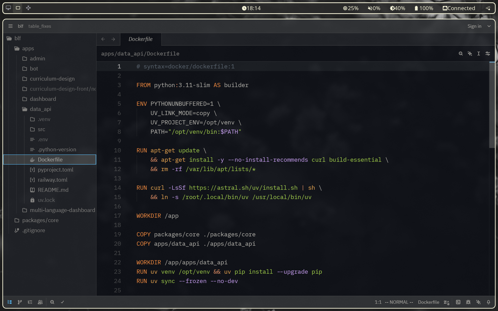

# My Arch Linux Rising

## Important
- Desktop-only setup: the configuration launches many background services, relies on Hyprland plugins and visual effects, and puts a noticeable load on RAM.
- Expect a few controversial/experimental choices (mixed layouts, aggressive autostart, custom eww widgets) that you should tweak to fit your own workflow.

## Configurations
- **Hyprland** (`configs/hypr/hyprland.conf`): hy3 plugin with tabbed layout, autostarts Waybar and hyprpaper, defines Wayland environment variables, provides screenshots via `grim + slurp`, color picking with `hyprpicker`, integrates eww widgets, and sets window rules for pavucontrol, blueman, and Zoom.
- **Waybar** (`configs/waybar/config`, `configs/waybar/style.css`): top bar with workspace icons, clock, and status modules (memory, audio, backlight, battery, network, language); styling mirrors the Hyprland theme with 8px rounding, translucent background, and rose-pine palette.
- **Kitty** (`configs/kitty/kitty.conf`): Kanagawa colors, Mononoki Nerd Font, slightly transparent background, tab bar tweaks, and key bindings for tabs and windows.
- **Wofi** (`configs/wofi/style.css`): Wayland launcher matching the desktop theme with blur, rose-pine borders, and JetBrains Mono typography.

## Hyprland Key Bindings
- `Super + Q` — launch the Kitty terminal.
- `Super + E` — open Dolphin.
- `Super + Space` — toggle fullscreen on the focused window.
- `Super + C` — forcibly close the focused app.
- `Super + S` — full screenshot to `~/Screenshots` and clipboard.
- `Super + D` — region screenshot to file and clipboard.
- `Super + N` — run the `hyprpicker` color picker.
- `Super + G` / `Super + Ctrl + G` — manage hy3 tab groups and switch tabs.
- `Super + Arrow keys` — change focus; `Super + Shift + Arrow keys` — move the focused window.
- `Super + [1–0]` — switch workspaces; `Super + Shift + [1–0]` — move window to workspace.
- `Super + mouse wheel` or `Super + Alt + ←/→` — cycle workspaces.
- `Super` + hold `LMB` — drag window; `Super` + `RMB` — resize; `Super + Alt + LMB` — toggle floating mode.
- `Super + W` — open the eww widget stack; `Super + L` — toggle the eww dashboard.
- `Alt + Enter` — play/pause; `Alt + Shift (Right)` — next track; `Alt + Ctrl (Right)` — previous track.
- `F1/F2` — volume down/up; `F7/F8` — adjust backlight.

## Gallery

